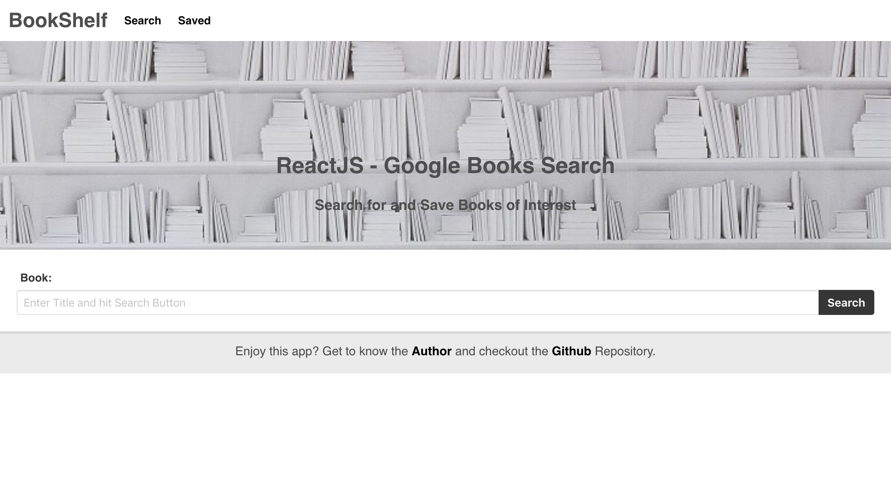
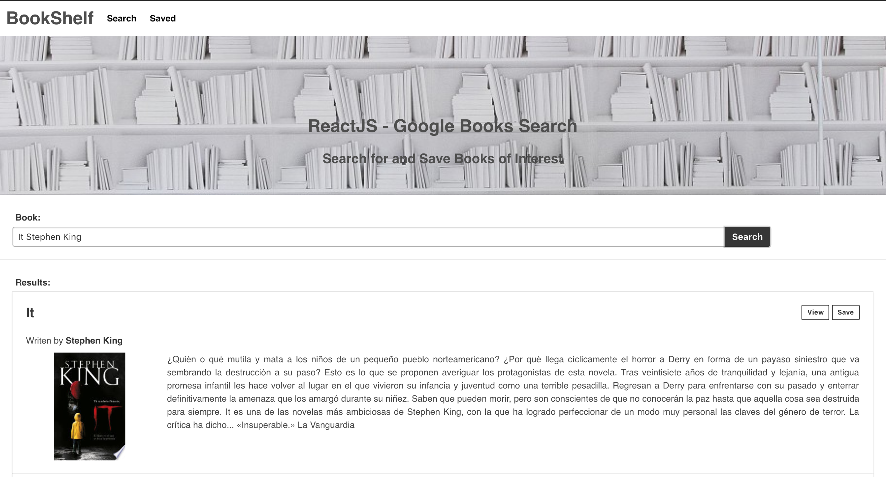
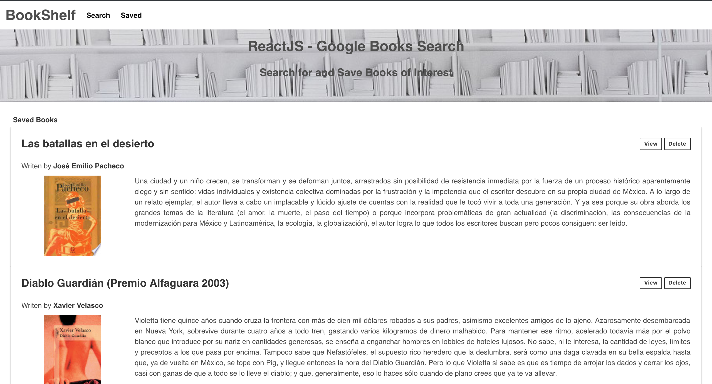
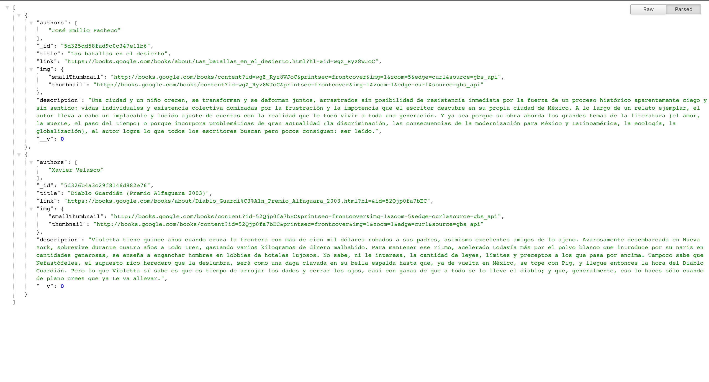

# Project Title

BookShelf - A Books Search App.

## Screenshots / Demo
Home Page

Search Results

Saved Books

API Books

## What the project does

BookShelf let the user search for and save any Books of interest using the Google Books Search app.

## Why the project is useful

It is a nice way to get a quick response when searching for books or even to make a wish/buy/read-list for books as the app lets you saved titles.

## How does it works

It is very easy and intuitive to use this app, the user just needs to type in a title on the search input form and hit the search button, once results are displayed the user can either go to the book by using the view button or save the book by using the save button. The user can always go to the Saved Page in order to see all of the saved books and even decide and delete a title upon reques by using the delete button.

## How can I use it

There are two ways to test this:

* The easy way: just go to the app page and test it [BookShelf](https://books-search-sergioardz.herokuapp.com/).
* The not that easy way: you would need to clone/download the repository and install the necessary dependencies with the command “npm install” and do not forget about the DB settings.

## Where users can get help with your project - Built With:

* [HTML](https://developer.mozilla.org/en-US/docs/Web/HTML)
* [CSS](https://developer.mozilla.org/en-US/docs/Web/CSS)
* [Javascript](https://www.javascript.com/)
* [React](https://reactjs.org/docs/getting-started.html)
* [NodeJs](https://nodejs.org/en/)
* [Express](https://www.npmjs.com/package/express)
* [Bulma](https://bulma.io/documentation/)
* [MongoDB](http://mongodb.github.io/node-mongodb-native/)
* [Mongoose](https://mongoosejs.com/)
* [axios](https://www.npmjs.com/package/axios)

## Who maintains and contributes to the project - Author:

* **Sergio Rodriguez** - [sergioardz](https://github.com/sergioardz).

## License

This project is licensed under the MIT License - see the [LICENSE.md](LICENSE.md) file for details.

## URLS

* [Github project](https://github.com/sergioardz/books-search)
* [Heroku project](https://books-search-sergioardz.herokuapp.com/)